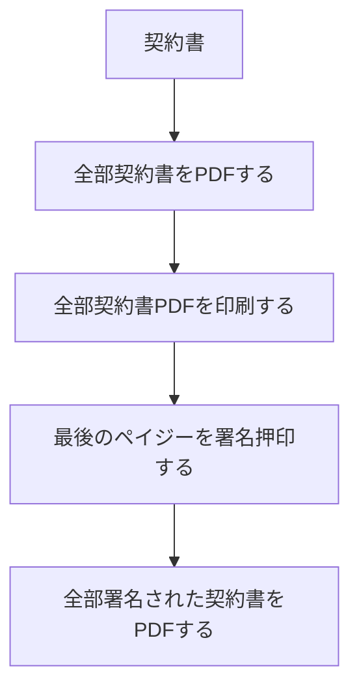
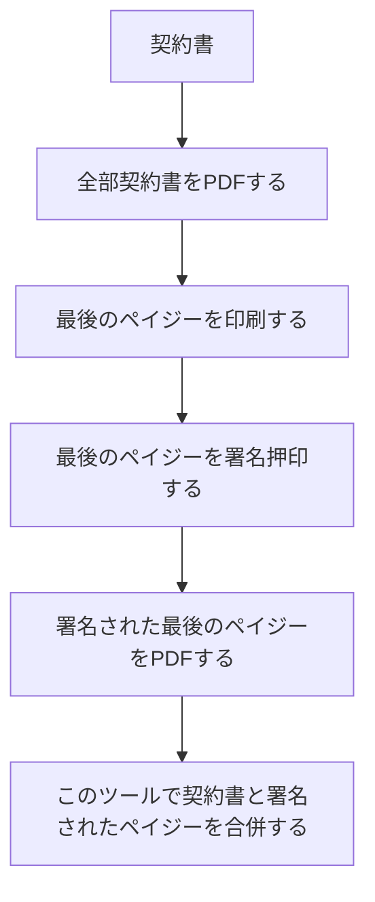

# python_merge_signed_pdf
Pythonで、署名されたPDFフェイルを結合する

## コンテクスト


```mermaid
  graph TD;
      契約書
      -->　全部契約書をPDFする
      -->　全部契約書PDFを印刷する
    　--> 最後のペイジーを署名押印する
    　--> 全部署名された契約書をPDFする;
```

## 今


```mermaid
  graph TD;
      契約書
      -->　全部契約書をPDFする
      -->　最後のペイジーを印刷する
    　--> 最後のペイジーを署名押印する
    　--> 署名された最後のペイジーをPDFする
    　--> このツールで契約書と署名されたペイジーを合併する;
```

## 設定

```sh
pip install --upgrade pymupdf
```

## 参照

* https://pymupdf.readthedocs.io/en/latest/the-basics.html